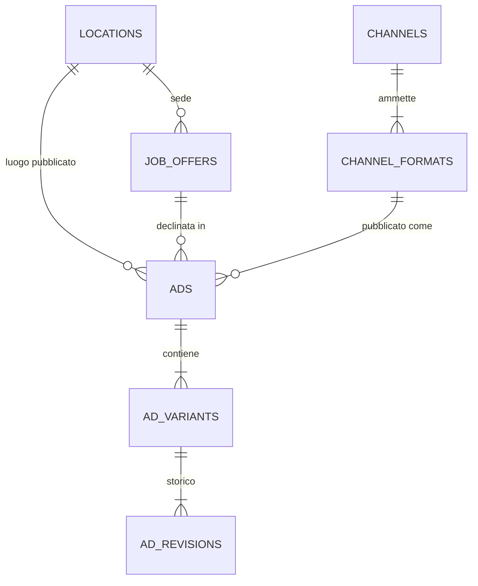
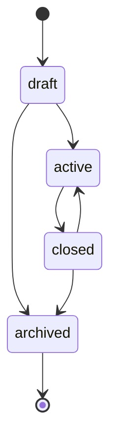

# Architettura

## 1. Come è diviso il progetto

Monorepo con npm workspaces: tre pacchetti con responsabilità separate e un solo comando per avviarli (`npm run dev`).

```
.
├── packages/
│   └── content/             # contratto del contenuto, condiviso da api e web
│       ├── src/
│       │   ├── index.ts       punto d'ingresso del pacchetto
│       │   ├── types.ts       kind, formati, parti ed errori
│       │   ├── primitives.ts  righe, liste e merge dei limiti
│       │   ├── blocks.ts      blocchi: limiti, default e schema Zod
│       │   ├── facts.ts       dati deterministici dalla job offer
│       │   ├── specs.ts       lettura di channel_formats.specs
│       │   ├── schema.ts      composizione: kind × formato → schema
│       │   └── guards.ts      guardrail sull'output LLM
│       └── test/            # test unitari e fixture riusabili (@job-ads-engine/content/testing)
├── apps/
│   ├── api/                 # backend Fastify
│   │   ├── db/
│   │   │   ├── migrations/  # schema SQL numerato, applicato in ordine
│   │   │   └── seed/        # canali, formati con i loro limiti, job offer (traccia + fittizie)
│   │   ├── data/            # DB di lavoro e copia della demo, creati all'avvio (non versionati)
│   │   ├── src/
│   │   │   ├── config.ts    # variabili d'ambiente validate, .env dalla root
│   │   │   ├── db/          # connessione, migrazioni, seed, esempi (samples) e demo; CLI db:*, samples, demo
│   │   │   ├── modules/     # job-offers, channel-formats, locations, ads: routes → service → repository
│   │   │   ├── llm/         # input_snapshot, prompt per kind, client Anthropic, validazione e retry
│   │   │   ├── render/      # formattazione it-IT, testo per kind, HTML di foglio A4 e creative
│   │   │   ├── http/        # validazione dell'input e formato unico degli errori
│   │   │   ├── app.ts       # app Fastify con le route sotto /api
│   │   │   └── server.ts    # avvio: .env, config, DB, client LLM, ascolto
│   │   └── test/            # integrazione seed ↔ contratto, poi il resto
│   └── web/                 # UI React + Vite (modulo opzionale)
│       ├── src/
│       │   ├── api.ts           client fetch, tipi delle risposte, errori tipizzati
│       │   ├── content-form.ts  modulo di edit generato dallo schema del formato
│       │   ├── create-ad.ts     dal modulo di creazione al corpo di POST /ads
│       │   └── components/      elenco, creazione, dettaglio, anteprima, edit, storico
│       └── test/            # logica pura: client, modulo di edit, creazione
├── demo_db/
│   └── gyver.db             # annunci d'esempio generati davvero (versionato, mai aperto direttamente)
└── package.json             # workspaces e script unici: dev, dev:demo, test, typecheck, db:reset
```

**Perché un pacchetto `content` separato.** Il contratto del contenuto ha tre consumatori:
- l'api, che valida output LLM ed edit manuali;
- il renderer, che impagina le parti;
- la UI, che valida gli edit prima di inviarli con lo stesso schema del server.

Tenerlo in un pacchetto dedicato evita di duplicare tipi e regole tra frontend e backend. È anche l'unico pacchetto senza dipendenze da Node, DB o rete: solo Zod.

**Dentro l'api** ogni livello ha una sola responsabilità:
- **routes**: HTTP, validazione dell'input, mapping degli errori. Nessuna logica di dominio.
- **service**: orchestrazione. Carica la job offer, chiama l'LLM, valida l'output e persiste in transazione.
- **repository**: solo SQL.

**Due database.** `npm run dev` lavora su `apps/api/data/gyver.db`, creato pulito da migrazioni e seed (job offer e canali, nessun annuncio). `npm run dev:demo` lavora su `apps/api/data/demo.db`, una copia di `demo_db/gyver.db` fatta al primo avvio: le prove non toccano mai il file versionato, e `npm run demo:reset` ricrea la copia. Nessuno dei due file di lavoro è versionato.

**In sviluppo** `npm run dev` avvia api e web insieme (`concurrently`, output etichettato per processo). Vite inoltra le chiamate `/api` al backend, quindi niente URL hardcoded e niente CORS.

**La UI** è una sola pagina, senza router né state manager: `fetch` e `useState`. Importa da `packages/content` solo lo schema del contenuto: il modulo di edit nasce da `z.toJSONSchema(contentSchemaFor(formato))`, con le `specs` lette da `GET /api/channel-formats`, quindi campi, limiti e contatori sono gli stessi del server senza codice per kind. I tipi delle risposte dell'API (`Ad`, `Variant`, `Revision`) sono ridefiniti in `apps/web/src/api.ts` con i soli campi usati: non fanno parte del contratto del contenuto, e importarli dall'api porterebbe nella UI i tipi di Node e del DB.

## 2. Modello dati



In più, `ad_variants.current_revision_id` punta alla revisione corrente della variante.

### Concetti

**Job offer.** È l'input interno: denso e non pubblicabile. Per questo servizio è read-only, perché arriva da altre entità; qui è seedata. Le colonne sono una proiezione del payload, che resta integro in `raw`. Il seed legge tutti i file `db/seed/job_offers*.json`: `job_offers.json` è la job offer della traccia, invariata; `job_offers.fictional.json` ne contiene nove inventate per provare la generazione su casi che `jo_001` non ha (RAL solo minima, assente o solo massima, apprendistato, dati scarni, un tentativo di prompt injection, part-time, ruolo senior, descrizione lunga, nessuna esperienza, sedi al Centro-Sud). Chi usa l'app ne aggiunge altre con un proprio file `job_offers*.json` (procedura nel readme). Il seed valida ogni job offer con il suo schema e con `factsSchema` del contratto: una job offer non valida si scarta con un avviso che nomina file, id e campo, senza bloccare le altre né l'avvio. Una job offer già caricata non si aggiorna; se il file è cambiato, il seed lo segnala.

**Canale e formato.**
- `channels` descrive la piattaforma e il suo `kind` (`job_board`, `messaging`, `social`).
- `channel_formats` elenca solo le combinazioni pubblicabili (canale × formato × proporzioni).
- `specs` di ogni riga contiene le dimensioni della tela e gli override dei limiti editoriali.

L'annuncio referenzia una riga di `channel_formats`, quindi una combinazione non prevista non è rappresentabile. Aggiungere un canale significa inserire righe, non migrare lo schema.

| Canale | Formati | Proporzioni |
|---|---|---|
| Indeed | text | — |
| WhatsApp | text, image, image_text | A4 |
| Instagram | image, image_text | 1:1, 4:5, 9:16 |
| TikTok | image, image_text | 9:16 |

**Annuncio (`ads`).** Definisce dove e come esce una job offer: formato di canale, luogo, stato. È il livello che si interroga per job offer e per canale.

**Variante (`ad_variants`).** È una composizione diversa del contenuto dello stesso annuncio, per A/B test.
- `angle` è la direzione data all'LLM per orientare il copy (es. "punta sulla crescita di carriera"). Si salva per poter rigenerare e per capire a posteriori cosa distingue due varianti.
- `is_active` spegne una variante perdente senza chiudere l'annuncio.

**Revisione (`ad_revisions`).** È il contenuto vero e proprio, append-only. Una modifica manuale crea una nuova revisione e sposta `current_revision_id`. Le precedenti restano consultabili e ripristinabili: il ripristino riporta il puntatore su una revisione esistente, senza crearne una nuova, così il contenuto non si duplica e la provenienza (`llm` o `manual`) resta quella originale.

**Luogo (`locations`).** Tabella condivisa tra job offer e annunci.
- Il luogo dell'annuncio è quello **mostrato** (es. il chip "Orzinuovi (BS)" del foglio WhatsApp). Di default è quello della job offer, ma può differire.
- `location_precision` (`address`, `locality`, `province`) dice quanto dettaglio mostrare: Indeed vuole l'indirizzo completo, un'ad basta "Orzinuovi (BS)".
- C'è un luogo per annuncio: più aree geografiche significano più annunci.
- La chiave è un id surrogato, non il CAP: un CAP può coprire più comuni e un luogo a livello provincia non ne ha uno.
- Il luogo non è copiato nel contenuto: si renderizza dall'annuncio, così cambiarlo non lascia revisioni incoerenti.

### Contenuto (`ad_revisions.content`)

Il **formato** decide quali parti esistono, il **kind** decide com'è fatta ciascuna:

```ts
content = {
  facts,    // sempre: dati deterministici
  text?,    // se format ∈ {text, image_text}
  image?    // se format ∈ {image, image_text}
}
```

| kind | `text` | `image` |
|---|---|---|
| job_board | `JobDescription` | — |
| messaging | `ChatMessage`: apertura, bullet, CTA | `JobSheet` A4: titolo, sottotitolo, tag, `JobDescription` |
| social | `Caption`: testo, CTA, hashtag | `Creative`: titolo con evidenziazione, hook, sottotitolo, descrizione della foto |

**`facts` non li genera l'LLM.** Contengono azienda, contratto, esperienza, RAL e competenze, copiati dalla job offer: sono dati, non copy. Il modello sceglie solo *come* presentare la RAL (`framing`: `range`, `from`, `up_to`), mai i numeri. Chip e righe RAL li compone il renderer da `facts`.

**`JobDescription` è condivisa** tra Indeed e il foglio WhatsApp: negli esempi della traccia i due testi coincidono, e un blocco unico impedisce che divergano.

**I limiti sono dati.** Ogni blocco ha limiti editoriali di default in `blocks.ts`; una riga di `channel_formats` li sovrascrive in `specs` solo dove serve. Alcuni esempi:
- il messaggio WhatsApp da solo ha 3–6 bullet, accanto all'immagine 0–2;
- nelle creative titolo, hook e sottotitolo hanno limiti **morbidi**: le righe social alzano il massimo del 20% sopra l'obiettivo editoriale (36 invece di 30; per l'hook in 9:16, 48 invece di 40). Il prompt chiede l'obiettivo, e il renderer riduce il font dei testi che lo superano (`apps/api/src/creative-fit.ts`).

Lo schema Zod si costruisce a runtime da kind, formato e `specs`. Cambiare un limite è un UPDATE, non un deploy.

**Le proporzioni cambiano layout e limiti, non lo schema.** 1:1, 4:5 e 9:16 usano la stessa `Creative` e un solo template HTML che si adatta alle dimensioni della tela (in 9:16 i caratteri crescono).

**Due schemi per ogni combinazione:**
- `llmOutputSchemaFor`: ciò che l'LLM deve produrre, cioè solo le parti generate più `salary_framing`;
- `contentSchemaFor`: ciò che si salva, cioè `facts` più le parti; valida anche gli edit manuali.

Il livello superiore è strict: un formato `image` con una parte `text` è rifiutato. `schema_version` permette di far evolvere le forme.

### Stati

Ciclo di vita dell'annuncio:



- Un annuncio chiuso si può riattivare; uno attivo va chiuso prima di essere archiviato.
- `archived` è terminale.
- Una transizione non ammessa è un errore (`409`) e lascia lo stato invariato.

Contenuto e stato sono assi indipendenti: modificare il copy crea una revisione e non tocca lo stato.

### Integrità

Garantita dal database:

| Regola | Come |
|---|---|
| Solo combinazioni canale/formato previste | FK su `channel_formats` |
| Formato testo senza proporzioni, formato immagine con proporzioni | CHECK |
| La revisione corrente appartiene alla stessa variante | FK composta `(current_revision_id, id) → ad_revisions(id, variant_id)` |
| Revisioni immutabili | trigger che bloccano UPDATE e DELETE |
| Una revisione `llm` è sempre tracciabile, una `manual` non ha metadati di generazione | CHECK |
| JSON valido | CHECK `json_valid` |
| Nessun luogo duplicato, anche con campi NULL | indice UNIQUE con `COALESCE` |

Garantita dall'applicazione:

| Regola | Come |
|---|---|
| Il contenuto ha esattamente le parti del formato | `z.strictObject` al livello superiore |
| Lunghezze e numero di elementi per canale | limiti di default + override da `specs` |
| `specs` coerenti (es. min ≤ max, nessuna chiave sconosciuta) | validate alla lettura, errore di configurazione |
| RAL coerente con il framing scelto | refine su `facts`, con ripiego su un framing valido |
| Nessuna cifra della RAL nel testo generato | `findSalaryLeaks` sull'output LLM |
| Nessuna frase per contrapposizione, nessuna emoji, nessun riferimento all'età nel testo generato | `findToneIssues` sull'output LLM (l'età non si controlla nella descrizione della foto) |

### Tracciabilità della generazione

Ogni revisione `llm` salva tre informazioni:
- `model`: il modello usato;
- `prompt_version`: la versione del prompt;
- `input_snapshot`: i dati esatti passati all'LLM.

Se un copy esce male, si capisce se la causa è il prompt, il modello o i dati. Se la job offer cambia dopo la generazione, si sa con quali dati era stato prodotto l'annuncio.

## 3. Flusso dati

1. **Richiesta**: job offer, formato di canale, eventuale luogo diverso, varianti da generare (label + angle).
2. **Proiezione**: dalla job offer si prendono i campi pubblicabili. Restano fuori id, stato, date e indirizzo civico: i luoghi arrivano al modello solo a livello di località.
   - `published_location` è il luogo dell'annuncio, da mettere in primo piano.
   - `workplace` è la sede, un fatto aziendale citabile.
   - Il risultato è l'`input_snapshot`: è anche l'unica cosa che lascia il sistema verso il provider.
3. **Prompt**: istruzioni del kind e limiti della riga nel prompt di sistema; `input_snapshot` (con l'angle) nel messaggio utente, dentro un blocco dati delimitato che il modello tratta come dato e mai come istruzione. Lo schema di output è `llmOutputSchemaFor`, convertito in JSON Schema.
4. **Generazione**: l'LLM produce JSON, che passa tre controlli:
   - validazione con `llmOutputSchemaFor`;
   - guardrail RAL;
   - guardrail di tono ed emoji.

   Se l'output non è conforme, si fa un retry passando gli errori; se fallisce ancora, `502` e nulla salvato. Se il provider non risponde (chiave assente, rete, timeout, rate limit), `503` e nulla salvato.
5. **Composizione**: `buildFacts(job_offer, salary_framing)` più le parti generate, poi validazione finale con `contentSchemaFor`.
6. **Persistenza**: annuncio, variante, revisione e puntatore in una sola transazione. Una variante non esiste mai senza contenuto.
7. **Lettura**: l'API restituisce l'annuncio con il contenuto corrente. Il renderer rilegge il contenuto con `contentSchemaFor` e produce il testo per canale e, per i formati con immagine, un documento HTML autosufficiente con le dimensioni delle `specs`. Luogo e dati deterministici li compone dai `facts` e dall'annuncio:
   - Indeed: campi strutturati (titolo, azienda, luogo, RAL, contratto, esperienza, competenze) più la descrizione;
   - WhatsApp: messaggio con `*grassetto*` e una riga `luogo · RAL · contratto`; il foglio A4 aggiunge gli stessi dati come chip;
   - social: la caption è solo testo generato; la creative mostra i loghi "Gyver × azienda", titolo evidenziato, hook, sottotitolo e il segnaposto della foto, senza RAL né luogo.

   Nessuna emoji, né nel testo generato (lo verifica un guardrail) né in quello composto dal renderer.

   In `JobDescription` la headline fa da titolo della sezione azienda, `role.title` della sezione ruolo; seguono "Quello che ti offrirà l'azienda:", aperta dalla riga RAL, e "Il tuo profilo:".

   La UI mostra l'anteprima e, per gli edit, valida il contenuto con lo stesso schema del server prima di inviarlo.

**Edit manuale**: nuova revisione `manual`, validata con `contentSchemaFor`, e aggiornamento del puntatore.

### Endpoint

Tutti sotto `/api`, JSON in ingresso e in uscita. L'input (parametri, query, body) è validato con Zod.

| Metodo e percorso | Cosa fa |
|---|---|
| `GET /job-offers` | Elenco sintetico: `id`, `title`, `company_name`, `location` |
| `GET /job-offers/:id` | Job offer completa, con luogo e skill (senza `raw`) |
| `GET /channel-formats` | Combinazioni pubblicabili con `kind` e `specs`: bastano a ricostruire lo schema degli edit |
| `GET /ads?job_offer_id=&channel=&status=` | Annunci, dal più recentemente aggiornato |
| `GET /ads/:id` | Annuncio con varianti e revisione corrente di ognuna |
| `POST /ads` | Genera annuncio e varianti (1–4, una chiamata LLM per variante, in parallelo) e li salva in una transazione |
| `POST /ads/:id/variants` | Genera una nuova variante con la prima label libera |
| `PATCH /ads/:id` | Cambia lo stato |
| `PATCH /variants/:id` | Accende o spegne una variante (`is_active`) |
| `GET /variants/:id/revisions` | Storico, dal più recente |
| `POST /variants/:id/revisions` | Edit manuale: nuova revisione `manual`, validata con `contentSchemaFor` |
| `PUT /variants/:id/current-revision` | Ripristino: sposta il puntatore su una revisione esistente |
| `GET /variants/:id/preview` | `{ text, html }` renderizzati; con `?as=html` la pagina HTML, servita con una CSP che non ammette script |

Corpo di `POST /ads`: `{ job_offer_id, channel_format_id, location?, location_precision?, variants: [{ angle }] }`. Senza `location` si usa quello della job offer; senza precisione, `address` per le job board e `locality` per gli altri canali.

Un annuncio `archived` è in sola lettura: nuove varianti, edit, ripristini e accensioni rispondono `409`.

**Errori**, sempre nella forma `{ error: { code, message, details } }`:

| HTTP | `code` | Quando |
|---|---|---|
| 400 | `invalid_input` | Parametri, query o body non validi (`details`: campi ed errori) |
| 404 | `not_found` | Risorsa o route inesistente |
| 409 | `invalid_transition` / `ad_archived` | Transizione di stato non ammessa / annuncio archiviato |
| 422 | `invalid_content` | Edit manuale non valido per il formato (`details`: campi ed errori) |
| 502 | `generation_failed` | Output LLM non conforme dopo il retry (`details`: errori) |
| 503 | `provider_unavailable` | Chiave assente, rete, timeout, rate limit o errore del provider (`details.reason`) |
| 500 | `internal_error` | Tutto il resto, con messaggio generico: la causa resta nel log del server |

I messaggi non contengono mai credenziali né dettagli del provider.

## 4. Semplificazioni a cui badare

- Job offer seedata e read-only: nessuna sincronizzazione con la sorgente.
- Nessuna pubblicazione reale sui canali: lo stato vive solo qui.
- Formati con immagine resi solo in HTML, nessun export PNG.
- Foto e loghi sono segnaposto:
  - la foto è descritta da `visual_brief`, che andrebbe risolto su una libreria di asset;
  - il logo aziendale non esiste nei dati della job offer.
- I limiti di default sono scelte editoriali, non i limiti tecnici delle piattaforme.
- Le chiavi sconosciute nei blocchi annidati vengono scartate, non rifiutate. Solo il livello superiore è strict.
- Il guardrail RAL si applica solo all'output LLM (negli edit manuali decide l'umano) e riconosce solo le cifre esatte: in "da 32 a 38 mila" il 32 sfugge.
- Una chiamata LLM sincrona per variante.
- Nessuno storico dei cambi di stato e nessun autore sulle revisioni (manca l'autenticazione).
- `PRAGMA foreign_keys` va attivato su ogni connessione, altrimenti SQLite ignora le FK.
